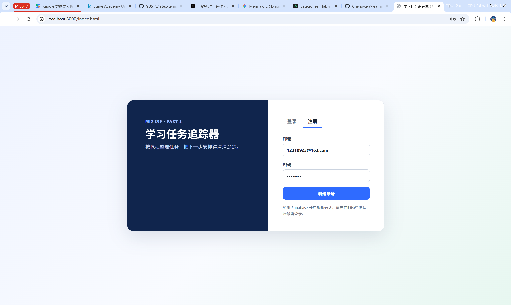
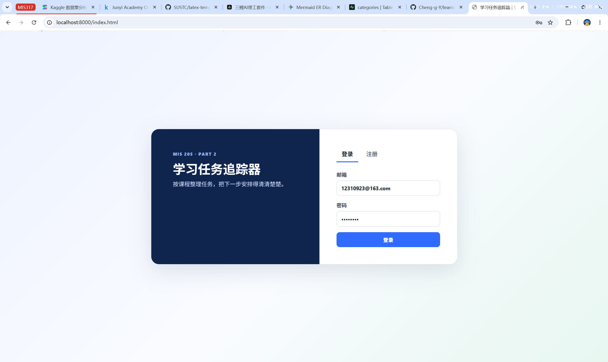
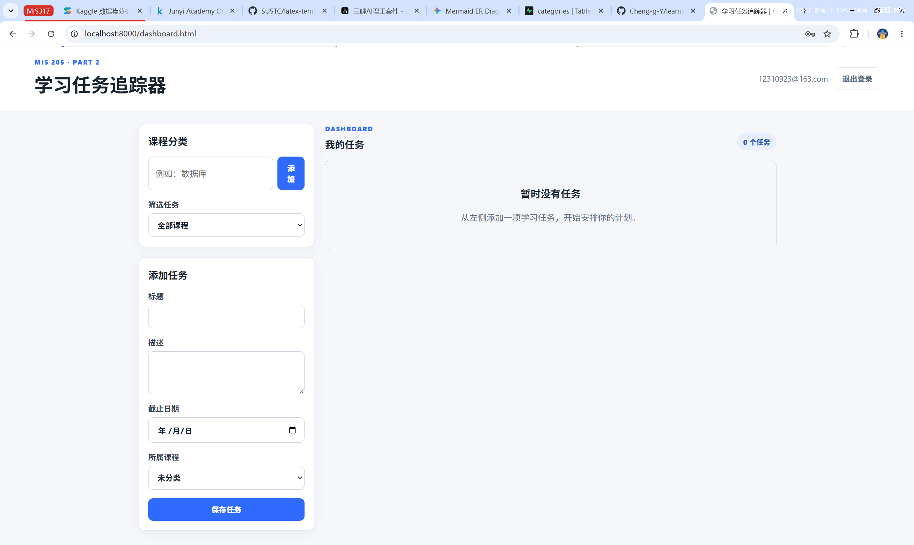
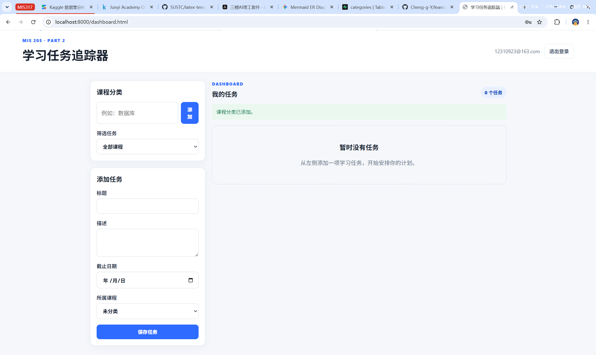
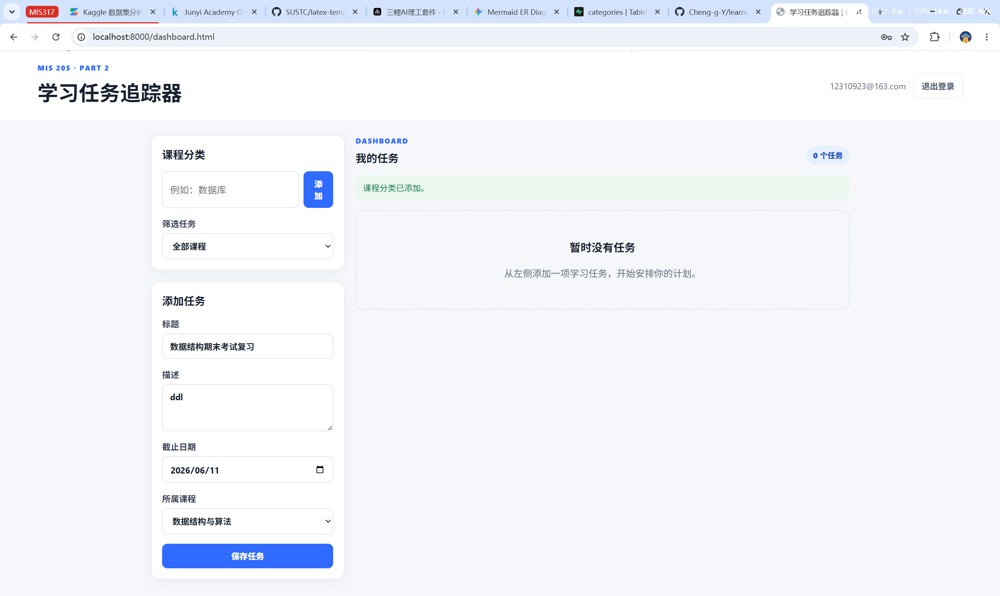
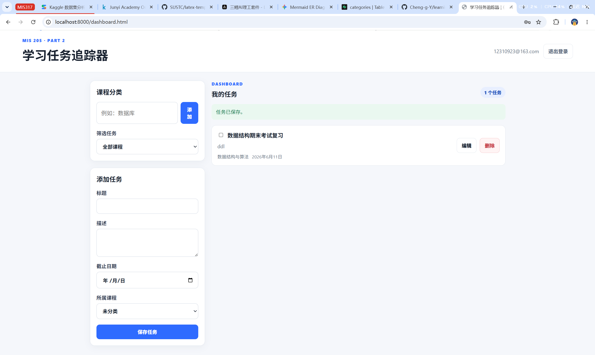
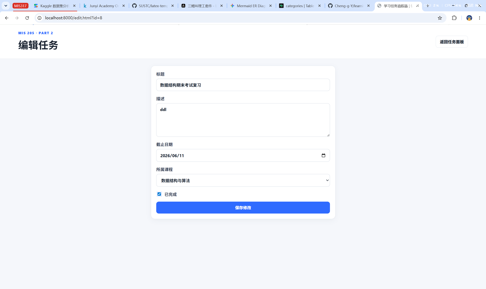
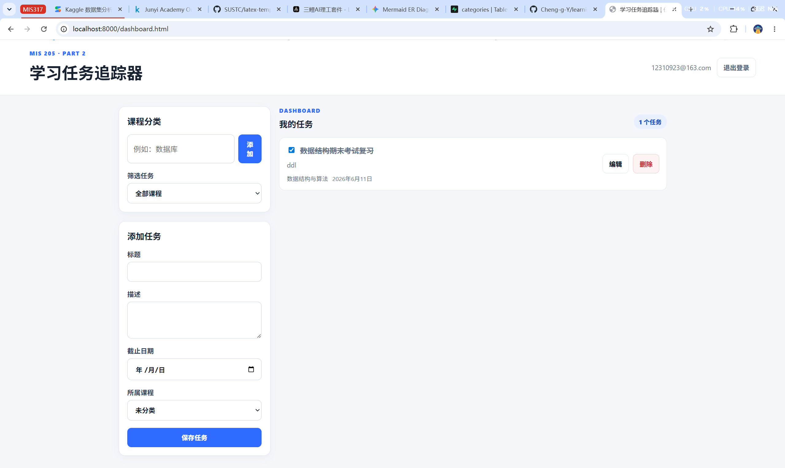
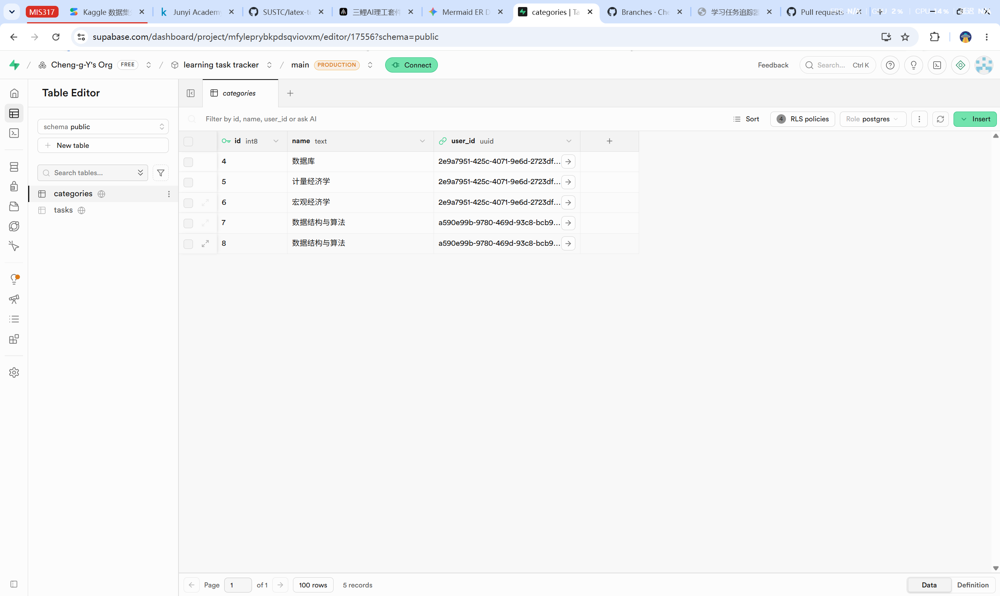
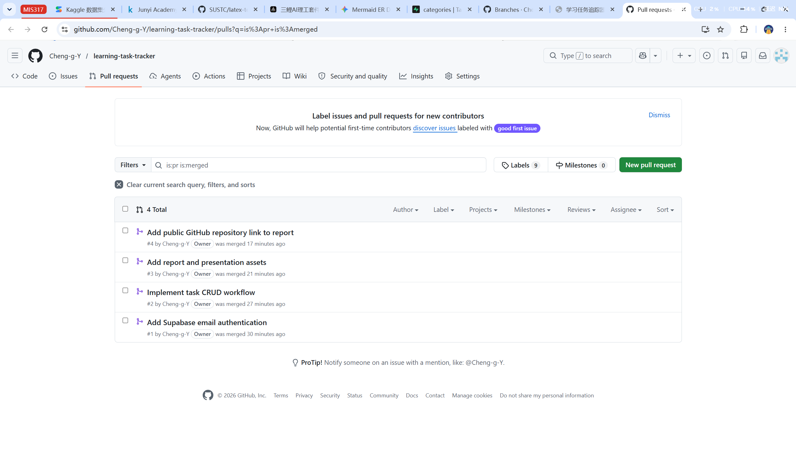

# MIS 205 Final Project Part 2 Report

## Student Information

- Name: 尹成果
- Student ID: 12310923
- Class: 01
- GitHub Repository: https://github.com/Cheng-g-Y/learning-task-tracker

## Project Overview

学习任务追踪器帮助学生按照课程管理学习任务。用户通过 Supabase Auth 注册和登录，可以创建课程分类，并对任务执行添加、查看、修改和删除操作。Supabase Row Level Security 保证用户只能访问自己的数据。

## Screenshots

### Authentication

| Registration | Login |
| --- | --- |
|  |  |

### Task CRUD

| Dashboard after registration | Add a course category |
| --- | --- |
|  |  |

| Enter a new task | View the saved task |
| --- | --- |
|  |  |

| Edit and mark the task as completed | Delete the task |
| --- | --- |
|  |  |

### Supabase And GitHub

| Supabase hosted tables | Merged GitHub pull requests |
| --- | --- |
|  |  |

## ER Diagram

```text
auth.users (1) ----< categories (many)
auth.users (1) ----< tasks      (many)
categories (1) ----< tasks      (many)
```
