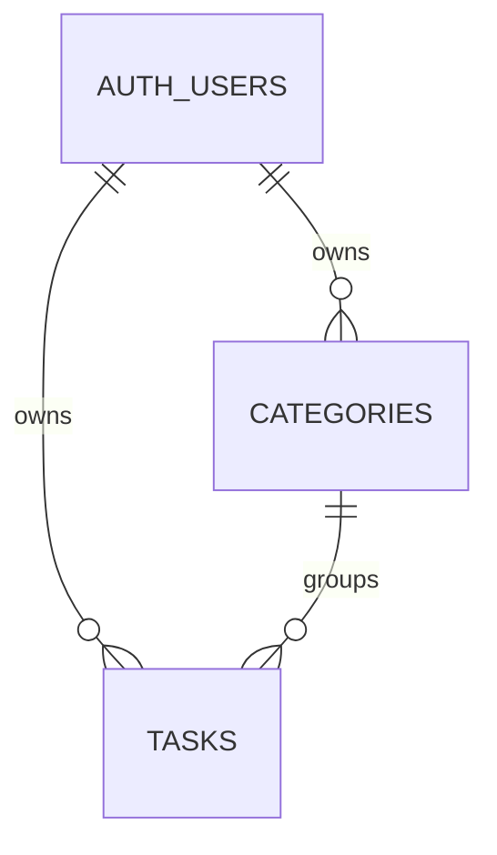

# 学习任务追踪器需求规格说明

## 1. 应用简介

学习任务追踪器是一款面向学生的 Web 应用。它帮助学生按照课程分类记录学习任务、安排截止日期并追踪完成状态。

## 2. 实体与属性

### Supabase Auth 用户 `auth.users`

| 属性 | 类型 | 说明 |
| --- | --- | --- |
| `id` | `uuid` | Supabase Auth 用户主键 |
| `email` | `text` | 用户登录邮箱 |

密码由 Supabase Auth 安全处理。本应用不会保存或查询明文密码。

### 课程分类 `categories`

| 属性 | 类型 | 说明 |
| --- | --- | --- |
| `id` | `bigint` | 主键 |
| `name` | `text` | 课程名称 |
| `user_id` | `uuid` | 外键，关联 `auth.users.id` |

### 学习任务 `tasks`

| 属性 | 类型 | 说明 |
| --- | --- | --- |
| `id` | `bigint` | 主键 |
| `title` | `text` | 任务标题 |
| `description` | `text` | 可选任务描述 |
| `due_date` | `date` | 可选截止日期 |
| `completed` | `boolean` | 是否完成 |
| `category_id` | `bigint` | 可选外键，关联 `categories.id` |
| `user_id` | `uuid` | 外键，关联 `auth.users.id` |
| `created_at` | `timestamptz` | 创建时间 |

## 3. 实体关系

- 一个用户可以拥有多个课程分类。
- 一个用户可以拥有多个学习任务。
- 一个课程分类可以包含多个任务。任务也可以暂时不属于任何分类。

## 4. 用户流程

1. 用户注册并登录，进入任务面板。
2. 用户创建课程分类，再创建属于该课程的学习任务。
3. 用户查看任务列表，按课程筛选任务，编辑任务、标记完成，并删除任务。

## 5. 安全与权限

- 使用 Supabase Email Auth 注册、登录和退出。
- 使用 Row Level Security 限制数据访问。
- 登录用户只能读取和修改 `user_id = auth.uid()` 的数据。
- 新增或修改任务时，任务只能关联当前用户拥有的分类。

## 6. 技术方案

- 前端：HTML、CSS、原生 JavaScript。
- 后端：Supabase Auth、Supabase 托管 PostgreSQL 和自动生成的 REST API。
- 数据库初始化：在 Supabase SQL Editor 中运行 `schema.sql`。
